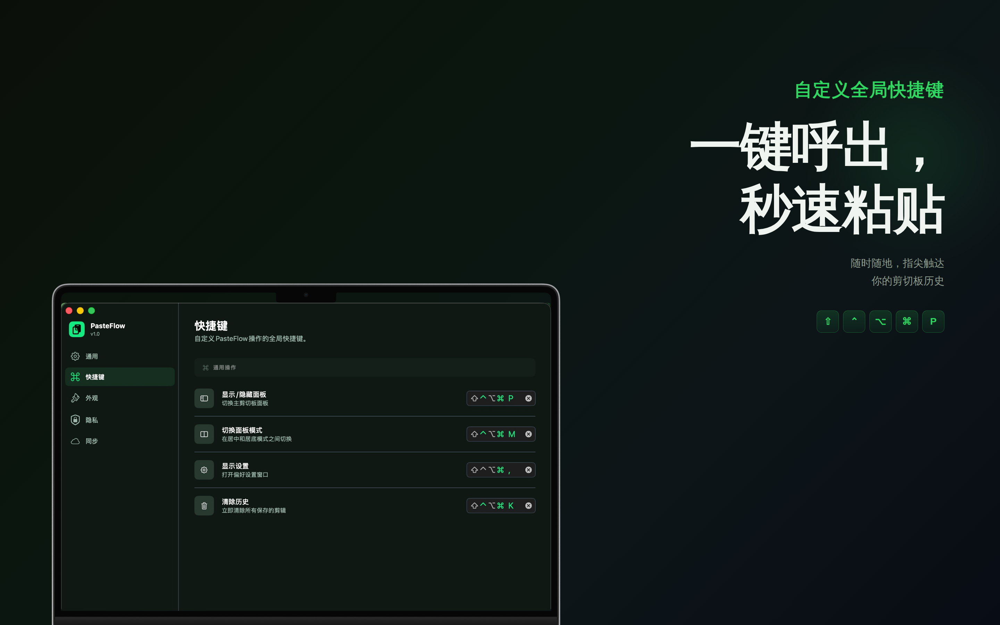
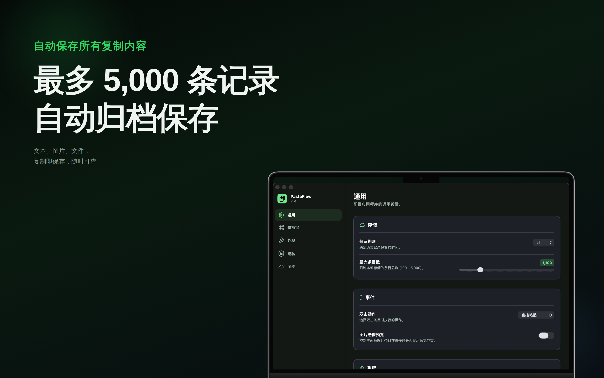
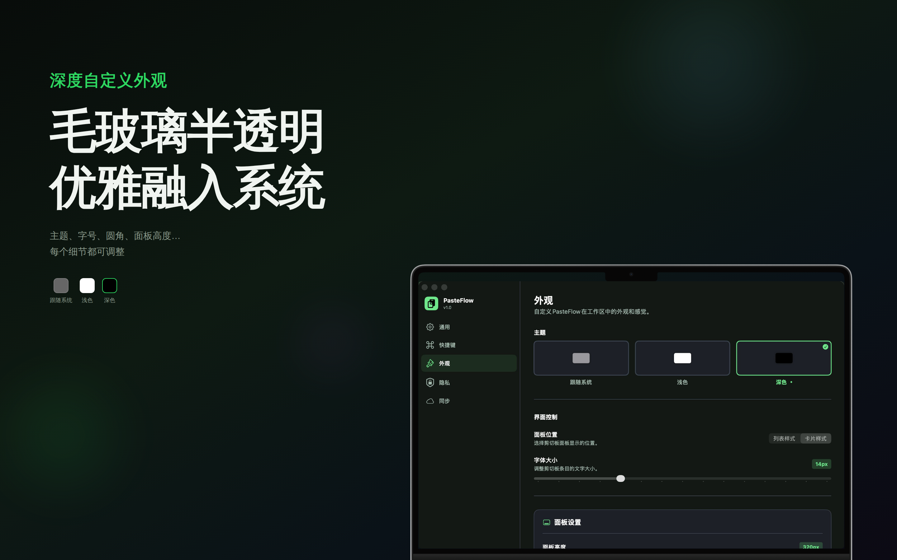
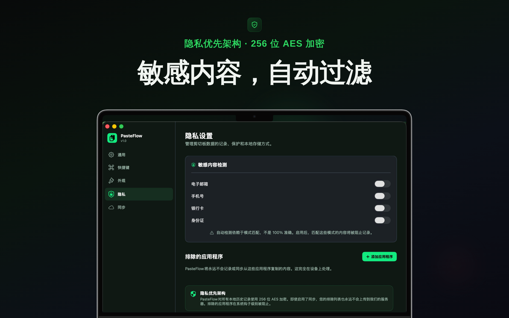

## 简介
PasteFlow 是一款智能剪切板增强工具。告别传统剪切板只能保存一条记录的限制,让每一次复制都被妥善保存,随时调用。

- 无限历史记录
• 自动保存所有复制内容,支持最多 5000 条记录
• 文本、图片、视频、文件全方位支持
• 智能识别内容类型,自动分类展示

- 快速检索
• 全文搜索,即输即查
• 按内容类型、来源应用智能分组
• 一键置顶常用内容,快速访问

- 高效操作
• 自定义快捷键,秒速呼出面板
• 来源应用图标标识,清晰追溯
• 精确时间记录,便于查找

- 精致界面
• 毛玻璃半透明设计,优雅融入系统
• 深色/浅色主题,跟随系统自动切换
• 居中/居底双模式,自由选择展示方式
• 可自定义圆角、字体大小等细节

- 隐私安全
• 所有数据仅存储在本地,绝不上传
• 自动过滤敏感内容,保护隐私

- 适用场景
• 写作创作 - 随时调用历史素材片段
• 编程开发 - 快速复用代码片段
• 设计工作 - 管理图片素材库
• 日常办公 - 提升文档编辑效率
• 多任务处理 - 在不同应用间快速传递信息

让 PasteFlow 成为你的效率倍增器,开启智能剪切板时代!

## 预览

|       |  |
| ----------- | ----------- |
|  |  |
|  |  |
|  |  |
