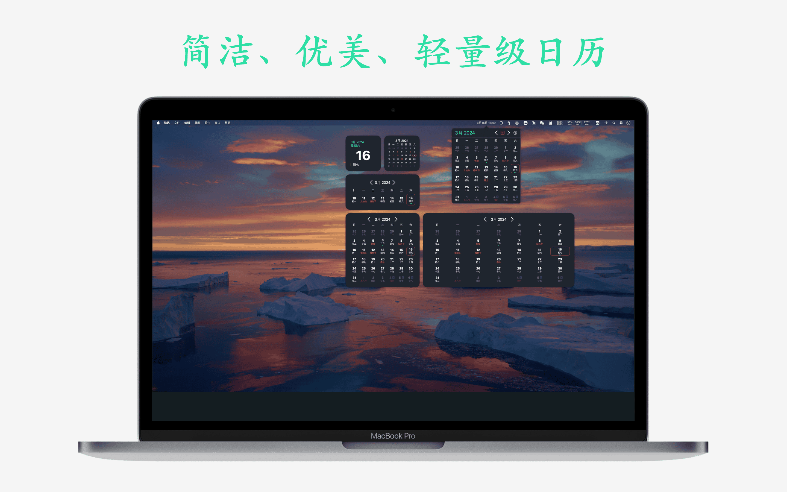

## 简介
小熊日历是 [iOS](https://apps.apple.com/app/id6478820878) & [macOS](https://apps.apple.com/app/id6477295542) 平台上一款简洁易用的日历，提供多种Widgets 样式让用户查看日历十分便捷，希望通过简洁的设计带给用户最方便的体验。

功能：
- 农历公历，节日节气和法定节假日
- 查看系统日历和提醒事项
- 自定义状态栏显示样式，支持图标和日期
- 提供多种主色调样式，适配深色模式
- 支持日、周、月三种小组件样式

## 预览

|       |  |
| ----------- | ----------- |
|  |  |
|  |  |
|  |  |
