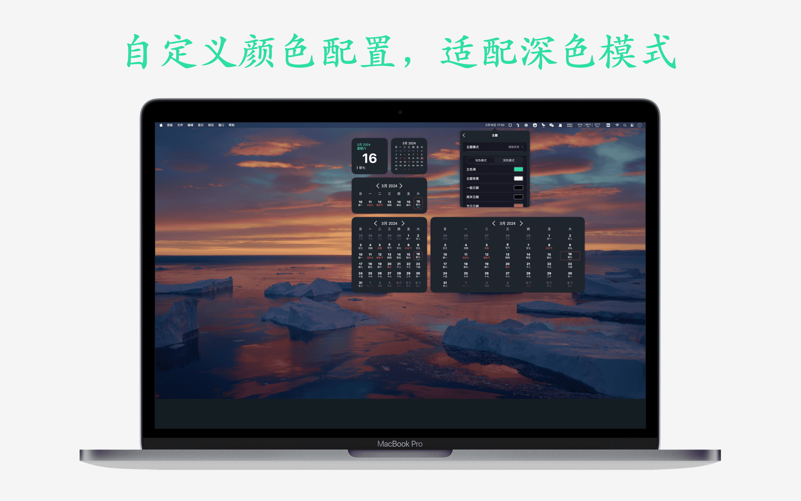

## 簡介
小熊日曆是 iOS & macOS 平臺上一款簡潔易用的日曆，提供多種Widgets 樣式讓用戶查看日曆十分便捷，希望通過簡潔的設計帶給用戶最方便的體驗。

功能：
- 萬年曆、農曆、節日節氣、每日宜忌、放假安排
- 全面的日曆查看功能，隨時掌握日期，您的時間管理專家
- 介面簡潔不冗餘，多種主題皮膚隨時切換，優質的中國日曆萬年曆
- 多種小組件供你選擇，總有一款適合您

## 預覽

|       |  |
| ----------- | ----------- |
|  |  |
|  |  |
|  |  |
