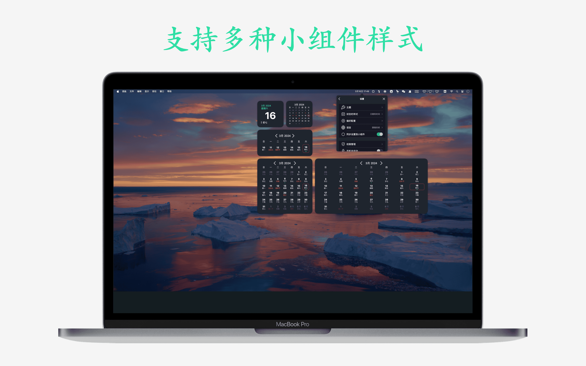

## Introduce
Bear Calendar is a simple and easy-to-use calendar on [iOS](https://apps.apple.com/app/id6478820878) & [macOS](https://apps.apple.com/app/id6477295542) platform, providing a variety of Widgets styles for users to view the calendar is very convenient, hope to bring users the most convenient experience through simple design.

Features:
- Lunar calendar, festive seasons and statutory holidays
- View system calendars and reminders
- Custom status bar display style, supporting icons and dates
- Provide a variety of dominant tone styles, suitable for dark mode
- Support daily, weekly and monthly widget styles

## Preview

|       |  |
| ----------- | ----------- |
|  |  |
|  |  |
|  |  |
