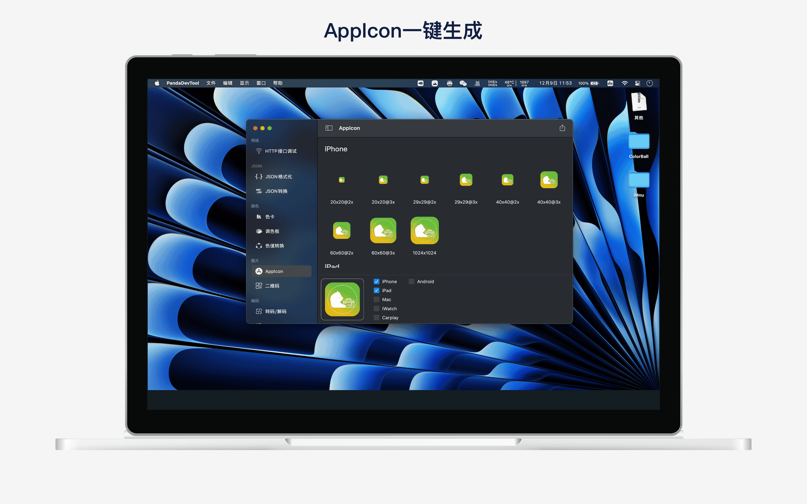
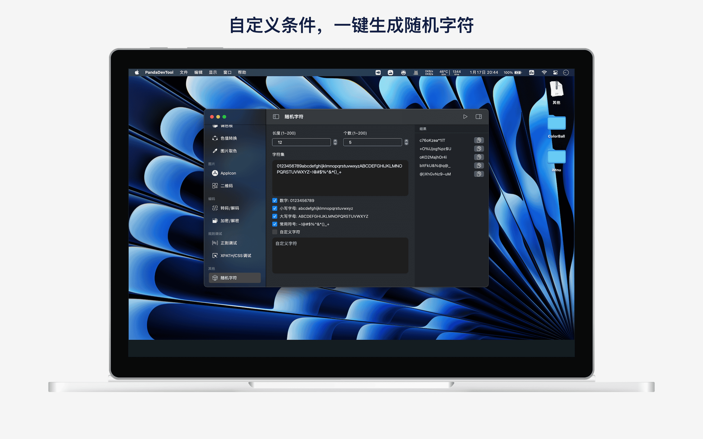

## Introduce
The Panda Toolbox is a development toolbox for programmers designed to improve development efficiency.

Functions:
- HTTP API debugging: supports get, post, put, delete, trace, head, options and other request methods
- JSON format: supports JSON compression, formatting, removing escape characters, exporting to files, etc.
- Color space: provide color cards, gradients, palettes, color value conversion
- AppIcon: import images and generate iPhone, iPad, Mac, iWatch, Carplay, Android icons with one click
- QR code: diversified QR code generation, supporting custom logo, watermark background, gif style
- String Encode: supports Unicode, URL and Base64 codec
- String encryption and decryption: supports common symmetric encryption such as AES and DES, and HASH algorithms such as SHA1, SHA224, SHA356, MD5, etc.
- Regular testing: regular expression debugging
- Xpath and Css debugging: support Xpath and Css debugging
- Random characters: custom character length, character set

## Preview

|       |  |
| ----------- | ----------- |
|  |  |
|  |  |
|  |  |
