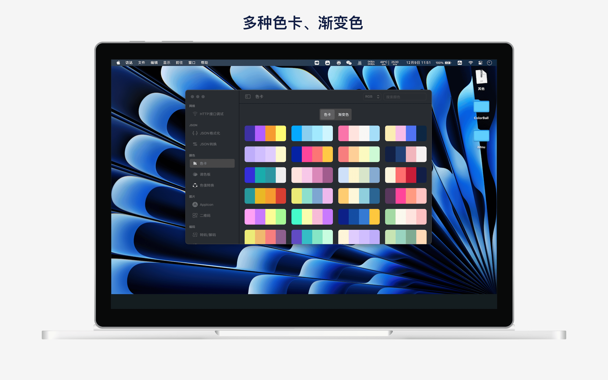

## 簡介
熊貓工具箱是一款為程式員提供的開發工具箱，旨在提高開發效率。

主要功能如下:
- HTTP接口測試: 支持get、post、put、delete、trace、head、options等請求方式
- JSON格式化：支持JSON壓縮、格式化、去除轉義符、導出至檔案等
- 色彩空間：提供色卡、漸變色、調色板、色值轉換
- AppIcon：導入圖片，一鍵生成iPhone、iPad、Mac、iWatch、Carplay、Android圖標
- 二維碼: 多樣化二維碼生成，支持自定義logo、水印背景、gif樣式
- 字串編解碼: 支持Unicode、URL、Base64編解碼
- 字串加解密: 支持AES、DES等常用對稱加密和SHA1、SHA224、SHA356、MD5等HASH算法
- 正則測試: 正則表達式測試
- Xpath和Css選擇測試: 支持Xpath和Css選擇測試
- 隨機字元: 自定義字元長度、字元集

## 預覽

|       |  |
| ----------- | ----------- |
|  |  |
|  |  |
|  |  |
