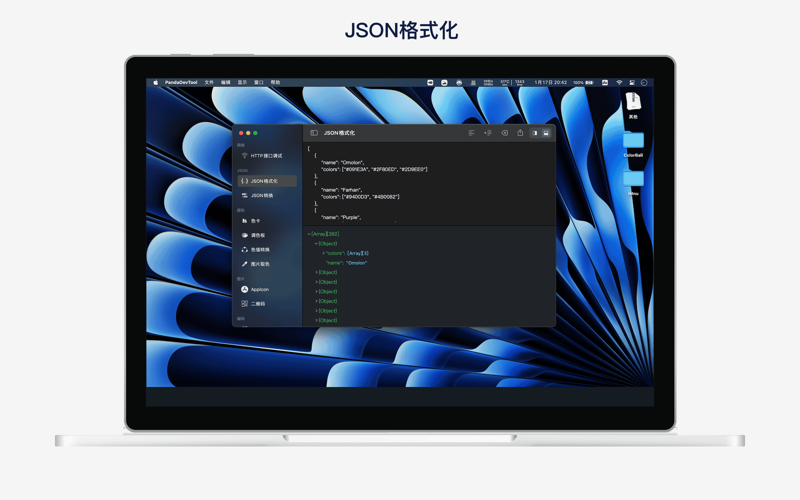
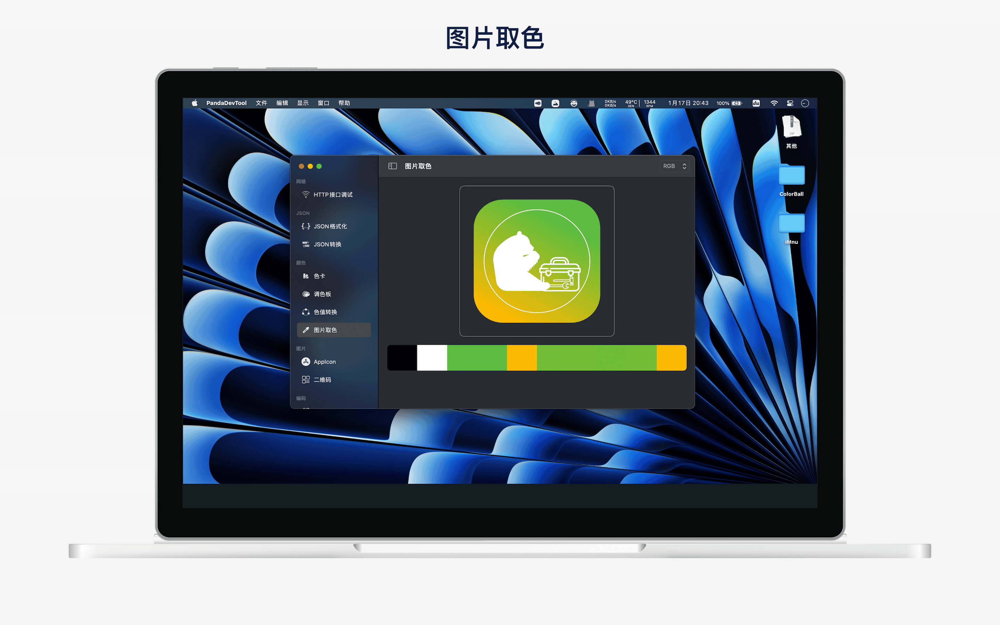

## 简介
熊猫工具箱是一款为程序员提供的开发工具箱，旨在提高开发效率。

主要功能如下:
- HTTP接口测试: 支持get、post、put、delete、trace、head、options等请求方式
- JSON格式化：支持JSON压缩、格式化、去除转义符、导出至文件等
- 色彩空间：提供色卡、渐变色、调色板、色值转换
- AppIcon：导入图片，一键生成iPhone、iPad、Mac、iWatch、Carplay、Android图标
- 二维码: 多样化二维码生成，支持自定义logo、水印背景、gif样式
- 字符串编解码: 支持Unicode、URL、Base64编解码
- 字符串加解密: 支持AES、DES等常用对称加密和SHA1、SHA224、SHA356、MD5等HASH算法
- 正则测试: 正则表达式测试
- Xpath和Css选择测试: 支持Xpath和Css选择测试
- 随机字符: 自定义字符长度、字符集

## 预览

|       |  |
| ----------- | ----------- |
|  |  |
|  |  |
|  |  |
